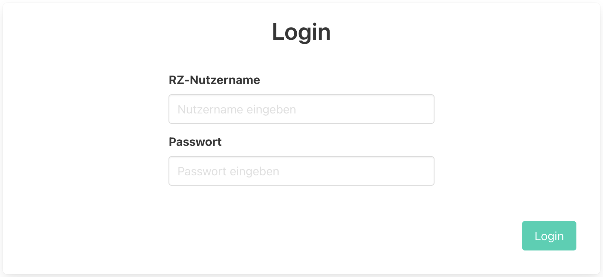

# Abschlussprojekt Device Manager Luca Woik
Abgabe für das Abschlussprojekt in ASE WS22/23.

## UR-DMS (Device Management System)

Die DMS Webapp bietet eine Geräteverwaltung für Geräte in den Hörsälen der Uni Regensburg.

### Technik
Die Web-App basiert auf einer REST-API 
(geschrieben mit dem [fastAPI-Framework](https://fastapi.tiangolo.com/)).
Als Datenbank wird zunächst [SQLITE](https://sqlite.org/index.html) verwendet, für den Einsatz
in einer Produktionsumgebung sollte allerdings auf eine "richtige" Datenbank umgestellt werden.
Für das Frontend und die Kommunikation mit dem Backend wird [React](https://react.dev/) verwendet, 
als CSS-Framework kommt [Bulma](https://bulma.io/) zum Einsatz.

### Verwendung
- Egal ob der Nutzer eingeloggt ist oder nicht können alle registrierten Geräte und die dazugehörigen
Informationen angezeigt werden.
  - Liste aller Geräte 
  - Detailansicht eines bestimmten Geräts 
- Zunächst wird der ein Login-Feld angezeigt, 
da Veränderungen an den Daten nur authentisiert erfolgen können.

- Ist der Nutzer eingeloggt, wird auch das Dashboard angezeigt


## Installation and Benutzung
1. Repository klonen: ``git@git.uni-regensburg.de:ase22ws/abschlussprojekt-device-manager-luca-woik.git``
2. In das geklonte Repository wechseln: `cd abschlussprojekt-device-manager-luca-woik`
3. Das Repository enthält ein ``docker-compose``- Setup.
Dafür sollte zunächst überprüft werden, dass die neuste Version von [Docker](https://www.docker.com/)
vorhanden ist. 
   1. Images erstellen: ``docker-compose build``
   2. Container erstellen und starten: ``docker-compose up -d``

Das Backend ist nun unter ``http://localhost:8000/api`` zu erreichen. Das Frontend läuft unter ``http://localhost:3000``.


## Dokumentation
Die eingebaute Swagger-Dokumentation is unter ```http://localhost:8000/docs``` zu erreichen.


***

## Lizenz
This software is licensed under the MIT License.

***

## Status des Projekts
Grundsäzliche API-Funktionen sowie die Verbindung zum Frontend sind implementiert.
Aufgrund der langen Einarbeitungszeit in Python (kaum vorherige Erfahrung mit der Sprache)
entspricht die Software noch nicht allen gegeben Anforderungen.
